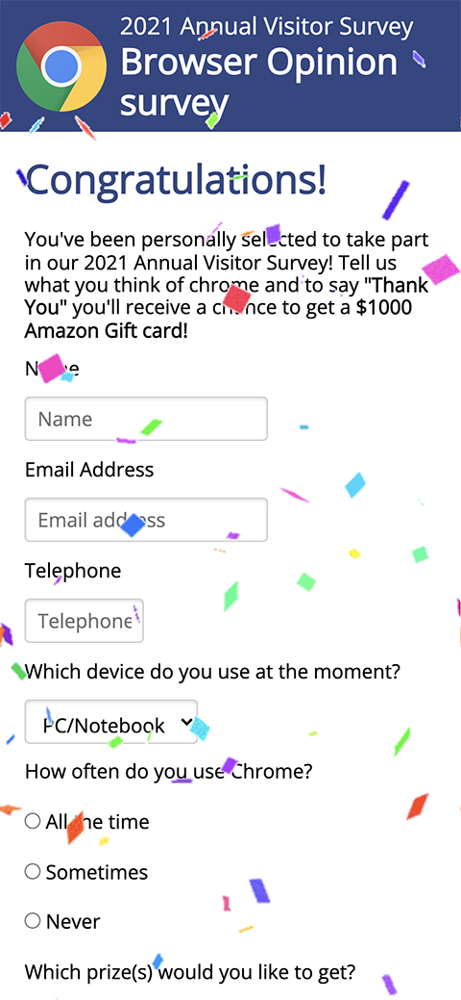

# Survey Scam

This webpage is one of my project for [Responsive Web Design Certification](https://www.freecodecamp.org/learn/responsive-web-design/) on [freeCodeCamp](https://www.freecodecamp.org/): [Build a Survey Form](https://www.freecodecamp.org/learn/responsive-web-design/responsive-web-design-projects/build-a-survey-form).  
The design is inspired by online survey scams.

## Table of Content

- [Live Demo](#live-demo)
- [Final Product](#final-product)
- [Dependencies](#dependencies)
- [Getting Started](#getting-started)

## Live demo

This app is built on [codepen](https://codepen.io/) and exported to distribute for live demo:  
https://scc416.github.io/survey-scam/

## Final Product

|    |
| :------------------------------: |
| _View of the webpage on desktop_ |

|     |
| :-----------------------------: |
| _View of the webpage on mobile_ |

## Dependencies

- [Pure](https://purecss.io/): style of the form

## Getting Started

1. Clone or download this repository onto your local device.
2. Open `index.html` with browser.
